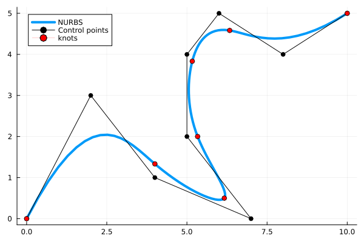
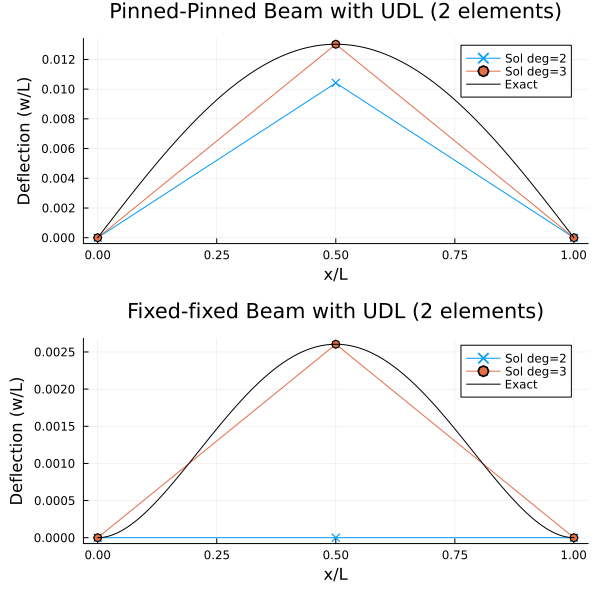
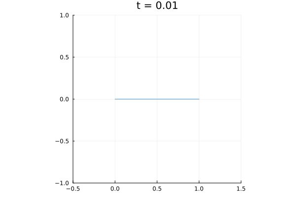

# Splines.jl

[](https://github.com/marinlauber/Splines.jl/actions)
[](https://codecov.io/gh/marinlauber/Splines.jl)

###  Isogeometric Analysis of non-linear Euler-Bernoulli Beams




[](https://github.com/marinlauber/Splines.jl/actions/workflows/CI.yml?query=branch%3Amain)

##### Things to do:

- [x] Validate on small deformation problems
- [x] Clean current implementation
- [x] Implement dynamic solver based on HHT-α method
- [x] Implement Quasi-Newton acceleration for the coupling 
- [x] Bind to [`WaterLily.jl`](https://github.com/weymouth/WaterLily.jl) via [`ParametricBodies.jl`](https://github.com/weymouth/ParametricBodies.jl) for fluid-structure interaction
- [ ] Validate on finite (i.e. large) deformation problems
- [ ] Benchmark solver
- [ ] Write better tests


### Test on analytic solutions

The analytical solution for this problem is
$$
w(x/L) = \frac{pL^4}{24EI}\left(\frac{x}{L} - 2\left(\frac{x}{L}\right)^3 + \left(\frac{x}{L}\right)^4\right)
$$
Using both 2nd and 3rd-order basis function (1st order cannot be used as the Euler-Bernoulli beam requires a continuous second derivative) we obtain the following results, which is exact for 3rd-order basis functions.

Similar results are obtained for a fixed-fixed beam, where the analytical solution is now
$$
w(x/L) = \frac{1}{24EI}\left(\frac x L\right)^2\left(1 - \frac{x}{L}\right)^2
$$



### Dynamic non-linear cantilever beam

The following results are obtained for a cantilever beam with a point load at the tip. The beam is discretized using 3rd-order basis functions and the periodic forcing is applied at the first resonant frequency



There are currenlty two Dynamic solvers implemented in the package, the Generalized-α method and the Newmark method. The Generalized-α method is the default method used in the package. The ρ∞ parameter is used to control the numerical damping of the system. The Newmark method is unconditionally stable for `ρ∞=1.0`, which results in `γ=0.5` and `β=0.25`.

#### Current usage

Development stage means that to use this package it is best to `dev` it

```julia
] dev https://github.com/marinlauber/Splines.jl
```

### Coverage 


