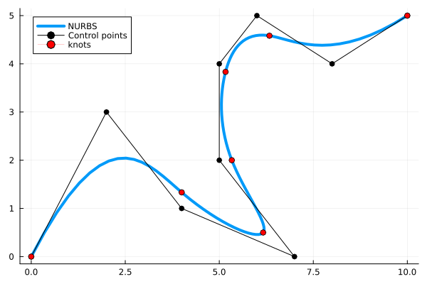

# Splines

###  Isogeometric Analysis of non-linear Euler-Bernoulli Beams




[](https://github.com/marinlauber/Splines.jl/actions/workflows/CI.yml?query=branch%3Amain)

##### Things to do:

- [x] Validate on small deformation problems
- [ ] Clean current implementation
- [x] Implement dynamic solver based on HHT-α method
- [ ] Implement Quasi-Newton acceleration for the coupling 
- [ ] Bind to [`WaterLily.jl`](https://github.com/weymouth/WaterLily.jl) via [`ParametricBodies.jl`](https://github.com/weymouth/ParametricBodies.jl) for fluid-structure interaction
- [ ] Validate on finite (i.e. large) deformation problems
- [ ] Benchmark solver
- [ ] Write better tests

#### Current usage

Developement means using it this way

```julia
] add https://github.com/marinlauber/Splines.jl
```

